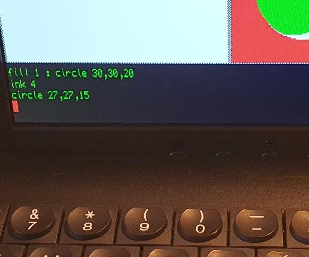
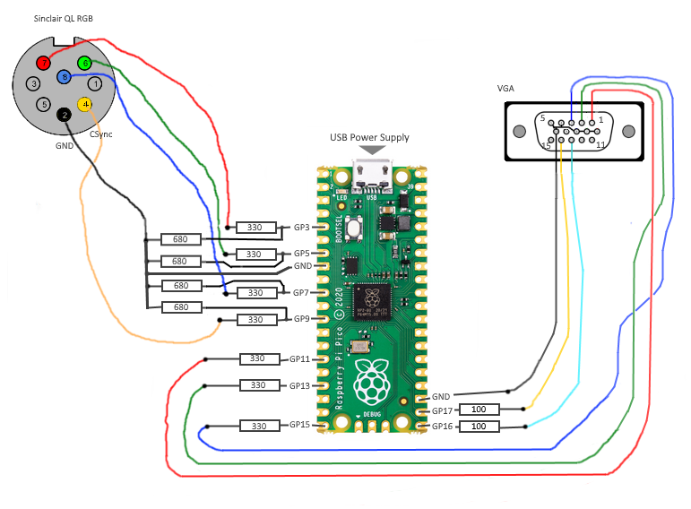
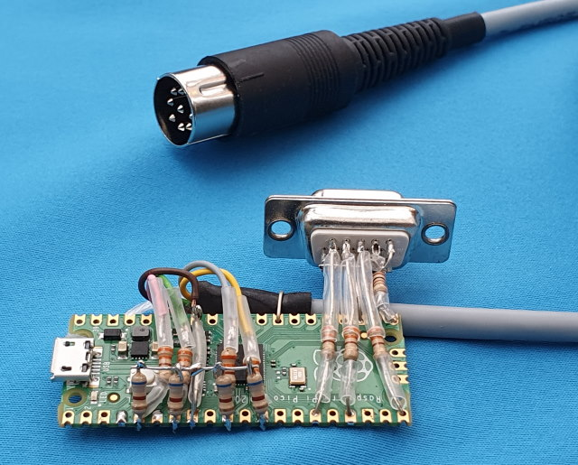

# **QLpicoVGA** - Video Interface QL-to-VGA with a Pi Pico 

This project creates the firmware for a DIY video interface based on the Rapsberry Pi Pico controller. It allows to connect a Sinclair QL computer to a standard VGA monitor.



One difficulty when using an old Sinclair QL nowadays is finding monitor that works well. The QL video output is a bit non-standard, many displays do not show the full 512 horizontal pixel, but instead crop the screen in some way.

This small Video-to VGA converter project is specially made for the QL signal and translates the 512x256 pixel screen to a standard pseudo-XGA resolution (1024x768 with a single QL pixel translating to a block of 2x3 XGA pixels). The Gold Standard for such a translation is the "QL-VGA" FPGA-based device by MarcelK. This project is a µC based C/C++ implementation, utilizing the highly configurable I/O of the RP2040 and its DMA capabilities for signal input and output. Phase and frequency detection and adjustment is done by the CPU on the fly utilizing fixed-point arithmetics.

- The VGA signal generation uses _MoeFH_'s simple but clever DMA-driven approach for the low-level part. Kudos to _MoeFH_!
- QL video signals are sampled at 32MS/s - with the QL Pixel clock running at 10MHz
- All timing parameters are specifically preset for the QL's video output, so the software will definitely not work well with any other video source, the project is not meant as a generic RGB-to-VGA converter.
- As a small diagnostic aid, the unavoidable "No Signal" bluescreen shows a simplified logic-analyzer type of graph for the input signals

## Hardware

This project is based on a Raspberry Pi Pico board and only needs a few additional components (resistors) for voltage level translation:





## QL to Pico:


```
QL RGB                            Pi Pico
Connector                          Module

7 (QLRED)   ----[R 330 Ohm]----  GP3=Pin 5 ----[R 680 Ohm]---- GND 
6 (QLGREEN) ----[R 330 Ohm]----  GP5=Pin 7 ----[R 680 Ohm]---- GND
8 (QLBLUE)  ----[R 330 Ohm]----  GP7=Pin10 ----[R 680 Ohm]---- GND

4 (QLCSYNC) ----[R 100 Ohm]----  GP9=Pin12 ----[R 680 Ohm]---- GND

2 (QLGND)   -------------------  GND=Pin8

```


## Pico to VGA:

```
Pi Pico                          VGA
Module                        Connector

GP11=Pin15 ----[R 330 Ohm]----  1 (RED)
GP13=Pin17 ----[R 330 Ohm]----  2 (GREEN)
GP15=Pin20 ----[R 330 Ohm]----  3 (BLUE)

GP16=Pin21 ----[R 100 Ohm]---- 13 (HSYNC)
GP17=Pin22 ----[R 100 Ohm]---- 14 (VSYNC)

GND=Pin23  ------------------- 6,7,8,10,5 (GND)
```

Note: Place all resistors close to the Pi Pico module (<5cm) for best signal integrity.


## Power Supply Input

Raspberry Pi Pico needs a standard USB power suppy (needs <100mA, so no special requirements for the power supply). Some VGA monitors may even provide USB voltage via an integrated USB hub. 

## 1st Prototype




(Ehem - yes I know but it works ;-)

# Loading the Firmware into the Pi Pico

Pi Pico operates like a USB memory stick when pushing the BOOTSEL button during while plugging into the USB port of a computer. Put the firmware "video_if_ql_vga.uf2" onto the drive. LED should show short flashes with a period of about 2 seconds. Please also refer to the Pi Pico documentation regarding firmware programming.

https://github.com/holmatic/video_if_ql_vga/releases

### Version Info

0.01 Initial version

---

Instruction v1.0
