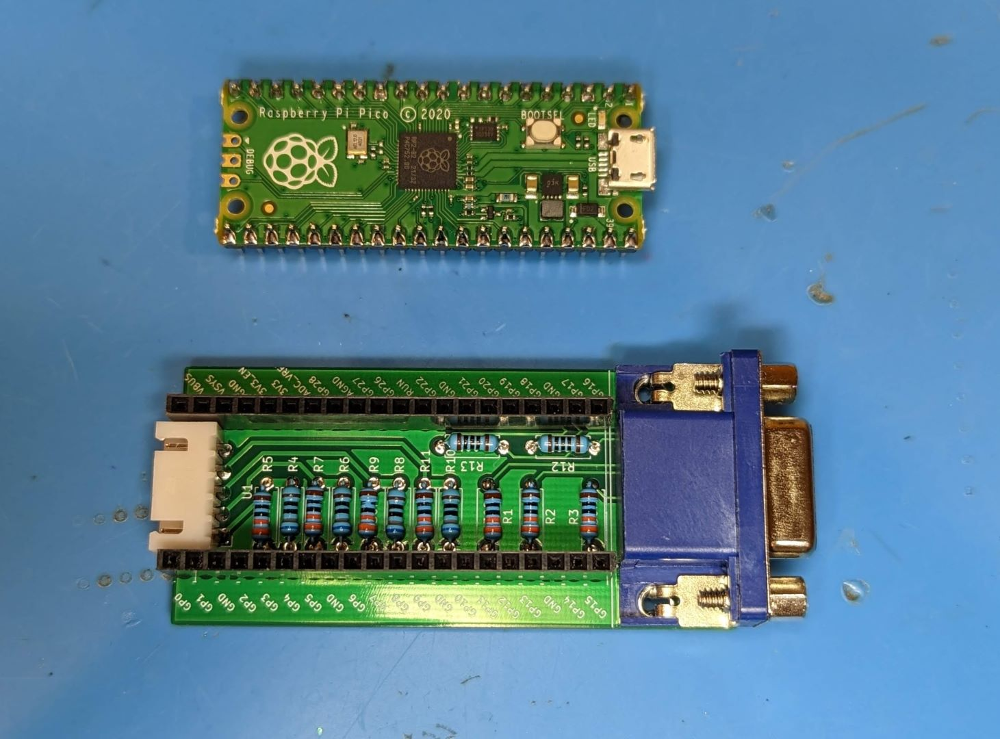
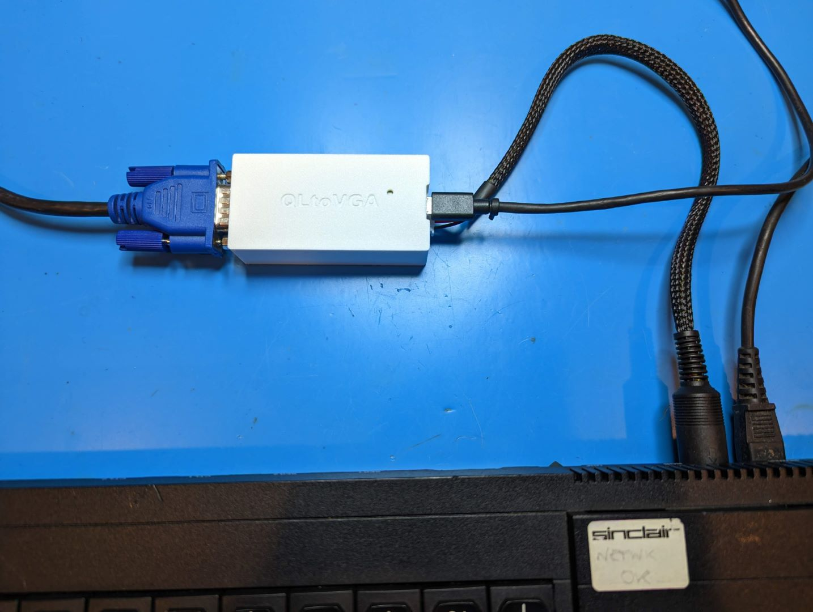
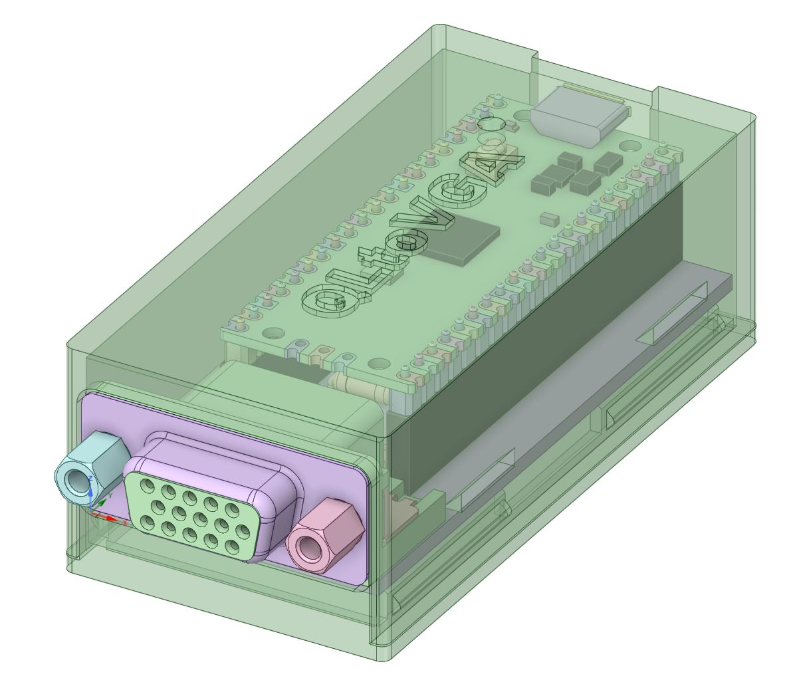

## PCB

To create your own PCB, send the gerber files off to your favorite PCB fab. There is an interactive BOM at [ibom.html](ibom.html), but most values are marked on the board itself.  All components can be sourced from the usual low cost Chinese vendors (AliExpress, etc.).

This is the VGA connector I used, https://www.aliexpress.us/item/2255799889288258.html

The Pico is mounted on 8.5mm tall 2.54mm female headers with 2.54mm male headers.

https://www.aliexpress.us/item/3256803886961825.html

For the video input, you can use any standard right angle 2.54mm spaced header or even solder the wires to the board. I went with an 5p XH2.54 connector which clips together a bit more securingly

https://www.aliexpress.us/item/2251832577362029.html

and then you can use the precrimped cables to make your input cable with a standard DIN 9 connector.  I sleeved the cable to make it look a little nicer, but that's optional.

https://www.aliexpress.us/item/2251832810520679.html

## Case

The case is a simple snapfit design done in DesignSpark.  It's optimized to be printed at 0.2mm layer height with no need for supports.

